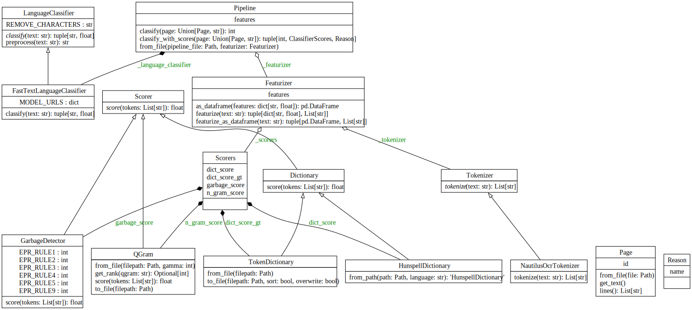

# Text Quality

A package to determine the quality of a a digitized text, from a handwritten script or scanned print (HTR/OCR output).

The current pipeline is tuned on (historic) Dutch language, and will not perform well on other languages.
However, the [underlying model](https://jdmdh.episciences.org/10239) has been used for other (Germanic) languages, and can be adapted and applied to texts of other languages and time periods.


## Examples

Good quality (not necessarily perfect):

```
Van
Malacca den 29 maart 1.
door zoo veel ruijmer handen te hebben,
[…]
Siac van waar op den 5=e deeser,
na onse verschijde adhortaties, is over
eeen gekomen
zoo meede van Siac
```

Bad quality:

```
uijtkoops --
winst suijverevense versis
e ee
,, 19
1 oe
na aftrek van
5 p:s C: Commiss:s
t 1a per 't geheel t p=s lb. off @'t geheeke
[…]
```

## What's Missing

- Pipelines for languages other than historic Dutch
- Automatic training procedure for creating and update pipelines
- Additional features such as publication year.

See [this notebook](notebooks/quality.ipynb) for a semi-automated pipeline creation process.

## How to use text_quality

After [installation](#installation), use the [classify_text_quality.py](scripts/classify_text_quality.py) script to classify PageXML or plain text files.
For instance, if you want to classify all `*.xml` files in the `pages/` directory, use the `--glob` argument:

```shell
classify_text_quality.py --glob "page/*.xml" --output classifications.csv --output-scores
```

Per input file, one output line is returned in CSV table format, along with the classification result:

1. Good quality
2. Medium quality
3. Bad quality

All supported parameters:

```console
$ classify_text_quality.py --help
usage: Classify the quality of a (digitized) text. [-h] [--input [FILE ...]] [--pagexml [FILE ...]] [--pagexml-glob PATTERN] [--output FILE] [--output-scores]

options:
  -h, --help            show this help message and exit
  --output FILE, -o FILE
                        Output file; defaults to stdout.
  --output-scores       Output scores and text statistics.

Input:
  --input [FILE ...], -i [FILE ...]
                        Plain text file(s) to classify. Use '-' for stdin.
  --pagexml [FILE ...]  Input file(s) in PageXML format.
  --pagexml-glob PATTERN, --glob PATTERN
                        A pattern to find a set of PageXML files, e.g. 'pagexml/*.xml'.
```

### Notes

The pipeline might emit warnings like this:

```console
UserWarning: X does not have valid feature names, but MLPClassifier was fitted with feature names
```

This is due to the internals of the [Scikit-Learn Pipeline object](https://scikit-learn.org/stable/modules/generated/sklearn.pipeline.Pipeline.html), and can safely be ignored.

The dependencies are pinned to specific versions.
While this prevents implicit updated even for patch-level updated of required libraries, it prevents misleading warnings emitted by varying Scikit-Learn versions.
Hence, requirement dependecies can be changed manually, if you are aware of these issues.

The project setup is documented in [project_setup.md](project_setup.md). Feel free to remove this document (and/or the link to this document) if you don't need it.

## Installation

To install the `text_quality` package:

```shell
pip install -U text-quality
```

Alternatively, install the package from GitHub repository:

```shell
git clone https://github.com/LAHTeR/htr-quality-classifier.git
cd htr-quality-classifier
python3 -m pip install -U .
```

## Documentation

[Readthedocs](https://htr-quality-classifier.readthedocs.io/en/latest/)

## Software Architecture

This diagram shows the class design of the `text_quality` package.



## Contributing

If you want to contribute to the development of text_quality,
have a look at the [contribution guidelines](CONTRIBUTING.md).

## Credits

Logic and implementation are based on [Nautilus-OCR](https://github.com/natliblux/nautilusocr).

This package was created with [Cookiecutter](https://github.com/audreyr/cookiecutter) and the [NLeSC/python-template](https://github.com/NLeSC/python-template).

## Badges

(Customize these badges with your own links, and check <https://shields.io/> or <https://badgen.net/> to see which other badges are available.)

| fair-software.eu recommendations | |
| :-- | :--  |
| (1/5) code repository              | [](https://github.com/laHTeR/htr-quality-classifier) |
| (2/5) license                      | [](https://github.com/laHTeR/htr-quality-classifier) |
| (3/5) community registry           | [](https://research-software-directory.org/projects/lahter) [](https://pypi.python.org/project/text_quality/) |
| (4/5) citation                     | [](https://doi.org/10.5281/zenodo.8190017) |
| (5/5) checklist                    | [](https://bestpractices.coreinfrastructure.org/projects/7672) |
| howfairis                          | [](https://fair-software.eu) |
| **Other best practices**           | &nbsp; |
| Static analysis                    | [](https://sonarcloud.io/dashboard?id=LAHTeR_htr-quality-classifier) |
| Coverage                           | [](https://sonarcloud.io/dashboard?id=LAHTeR_htr-quality-classifier) |
| Documentation                      | [](https://htr-quality-classifier.readthedocs.io/en/latest/?badge=latest) |
| **GitHub Actions**                 | &nbsp; |
| Build                              | [](https://github.com/laHTeR/htr-quality-classifier/actions/workflows/build.yml) |
| Citation data consistency               | [](https://github.com/laHTeR/htr-quality-classifier/actions/workflows/cffconvert.yml) |
| SonarCloud                         | [](https://github.com/laHTeR/htr-quality-classifier/actions/workflows/sonarcloud.yml) |
| MarkDown link checker              | [](https://github.com/laHTeR/htr-quality-classifier/actions/workflows/markdown-link-check.yml) |
